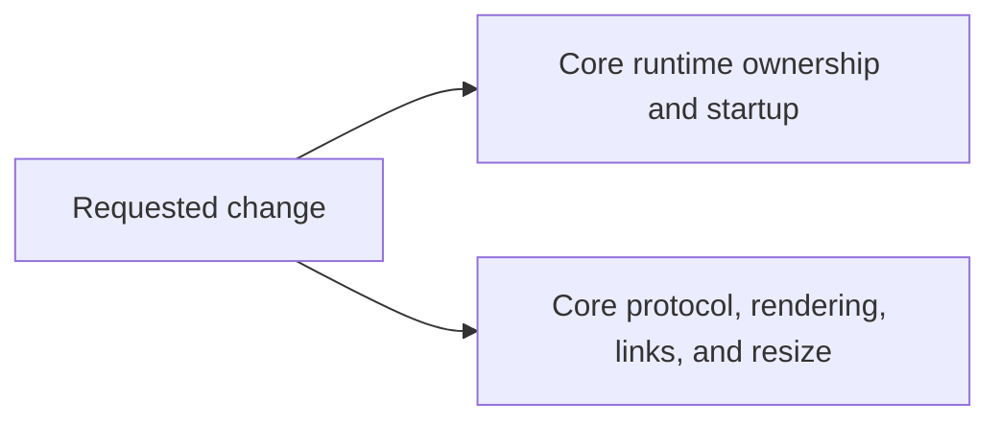

# Code Change Guardian

## Remove Alacritty from the shipped Termy terminal

> **IMPLEMENTED AND VERIFIED** · REFACTOR mode

Termy's shipped terminal implementation is now Tmon-only. The private Alacritty runtime, startup fallback, protocol/event bridge, render conversion layer, resize compatibility path, forced-backend switches, and normal dependencies were removed coherently across Core and its consumers. Alacritty remains only in Tmon's development-only semantic oracle and the standalone three-engine competitor benchmark approved for retention.

## Decision snapshot

| Field | Value |
|---|---|
| Requested change | Remove Alacritty entirely from Termy's shipped terminal implementation, including protocol/query_colors.rs. |
| Repository | `/Users/lassevestergaard/Dev/termy` |
| Branch / HEAD | `main` / `1abbc5dd` |
| Working tree | Dirty — preserve existing changes |
| Generated | 2026-08-17T07:40:00Z |

## Implementation outcome

- `termy_core::Terminal` now constructs and runs only the private Tmon backend; initialization failures propagate without a fallback.
- `protocol/query_colors.rs` is engine-neutral and supplies the ANSI palette plus the 256-color cube/grayscale fallback without Alacritty types.
- The obsolete Alacritty backend, reply bridge, resize anchor, event loop, PTY path, backend-specific tests, old two-engine benchmark, force switches, and workflow were deleted.
- Core, FFI, desktop, and xtask normal dependency graphs contain no `alacritty_terminal` package.
- The C ABI header is byte-for-byte unchanged.
- The public `ForcedAlacritty` diagnostic variant remains as a legacy Rust source-compatibility token, but the Tmon-only runtime never emits it.

### In scope

- Remove alacritty_terminal from termy_core and every shipped Rust binary.
- Delete the private Alacritty backend, startup fallback, force/test environment switches, and Alacritty event loop.
- Make Terminal Tmon-only while preserving its engine-neutral render, input, search, PTY, event, and FFI contracts.
- Replace Alacritty-coupled query color, protocol reply, frame, link, resize, desktop, FFI, tooling, and documentation paths.
- Update manifests and Cargo.lock so no shipped crate depends on Alacritty.

### Out of scope

- The non-workspace tools/tmon-ghostty-memory competitor harness, which links Alacritty directly for measurement.
- Tmon's dev-only Alacritty differential oracle, retained only for conformance tests.
- Historical comments and performance records that accurately describe past comparisons.

## Blast-radius map

| Surface | Relationship | Risk | Evidence | Files |
|---|---|---:|---|---|
| Core runtime ownership and startup | direct | high | engine_backend.rs selects two backends, runtime.rs contains the retained Alacritty PTY/event implementation, and native startup can fall back after eligible Tmon failures. | [crates/core/src/runtime.rs](crates/core/src/runtime.rs), [crates/core/src/runtime/engine_backend.rs](crates/core/src/runtime/engine_backend.rs), [crates/core/src/runtime/tmon_backend.rs](crates/core/src/runtime/tmon_backend.rs) |
| Core protocol, rendering, links, and resize | direct | high | query_colors.rs, replies.rs, backend.rs, frame.rs, links.rs, and resize_anchor.rs import Alacritty types or implement retained-backend behavior. | [crates/core/src/protocol/query_colors.rs](crates/core/src/protocol/query_colors.rs), [crates/core/src/protocol/replies.rs](crates/core/src/protocol/replies.rs), [crates/core/src/backend.rs](crates/core/src/backend.rs), [crates/core/src/frame.rs](crates/core/src/frame.rs), [crates/core/src/links.rs](crates/core/src/links.rs), [crates/core/src/resize_anchor.rs](crates/core/src/resize_anchor.rs) |
| Public diagnostics and FFI | downstream | high | TerminalEngineSelectionReason publicly exposes ForcedAlacritty and fallback cases; FFI has a forced-Alacritty disconnect regression, though the C header exposes no engine type. | [crates/core/src/runtime.rs](crates/core/src/runtime.rs), [crates/core/src/lib.rs](crates/core/src/lib.rs), [crates/ffi/src/lib.rs](crates/ffi/src/lib.rs), [crates/ffi/include/termy.h](crates/ffi/include/termy.h) |
| Desktop, persistence, benchmarks, and docs | downstream | medium | Persistence cross-tests private engines, xtask and justfile inject the force switch, and user/contributor docs promise a retained fallback. | [crates/desktop_app/src/terminal_view/persistence.rs](crates/desktop_app/src/terminal_view/persistence.rs), [crates/xtask/src/benchmark.rs](crates/xtask/src/benchmark.rs), [crates/xtask/examples/engine_compare.rs](crates/xtask/examples/engine_compare.rs), [justfile](justfile), [README.md](README.md), [crates/core/README.md](crates/core/README.md), [docs/libtermy.md](docs/libtermy.md) |
| Dependency and release metadata | downstream | medium | Workspace/Core/xtask manifests and Cargo.lock resolve alacritty_terminal, while the standalone benchmark and Tmon dev tests are separable from shipped graphs. | [Cargo.toml](Cargo.toml), [Cargo.lock](Cargo.lock), [crates/core/Cargo.toml](crates/core/Cargo.toml), [crates/xtask/Cargo.toml](crates/xtask/Cargo.toml), [crates/tmon/Cargo.toml](crates/tmon/Cargo.toml), [tools/tmon-ghostty-memory/Cargo.toml](tools/tmon-ghostty-memory/Cargo.toml) |

## Failure modes

| ID | What could break | Score | Tier | Primary mitigation |
|---|---|---:|---:|---|
| R1 | Native startup fails where the old fallback masked a Tmon backend-initialization failure | 15/20 | high | Preserve structured startup errors, test invalid launch versus backend failures, and compile-check Unix and Windows paths. |
| R2 | Query replies, clipboard requests, colors, or wakeups regress when Alacritty event translation is deleted | 13/20 | high | Port tests to public Terminal behavior and add focused Tmon-native OSC color, OSC 52, wakeup, and display-only regressions. |
| R3 | Rust embedders break on removed engine diagnostic enum variants | 12/20 | medium | Resolved by retaining the legacy variant names as non-emitted compatibility tokens while removing the implementation. |
| R4 | Frame, search, links, scrollback, resize, or damage lose coverage with backend-specific helper deletion | 14/20 | high | Rewrite behavioral tests through Terminal/Tmon fixtures before deleting helpers; run Core, terminal_ui, desktop, and FFI validation. |

### R1: Native startup fails where the old fallback masked a Tmon backend-initialization failure

- **Evidence:** Core currently retries eligible Tmon initialization failures with Alacritty.
- **Rollback:** Restore the coherent runtime refactor if supported hosts cannot start.

### R2: Query replies, clipboard requests, colors, or wakeups regress when Alacritty event translation is deleted

- **Evidence:** The retained backend uses reply_bytes_for_event; Tmon formats native replies and Core separately supplies clipboard data.
- **Rollback:** Revert the protocol slice without restoring raw engine types to public APIs.

### R3: Rust embedders break on removed engine diagnostic enum variants

- **Evidence:** TerminalEngineSelectionReason remains publicly re-exported, so the legacy `ForcedAlacritty` spelling was retained without any selection path that can emit it.
- **Rollback:** Not required; compatibility names and runtime ownership are already separated.

### R4: Frame, search, links, scrollback, resize, or damage lose coverage with backend-specific helper deletion

- **Evidence:** Several tests instantiate raw Alacritty Term values even though Tmon owns shipped behavior.
- **Rollback:** Revert the affected behavior slice rather than restoring a second runtime.

## Contracts to preserve

| Contract | Required behavior | Evidence | Protection |
|---|---|---|---|
| Terminal facade | Construction, feed/hydrate, PTY I/O, snapshots, rich visitors, search, links, scrolling, cursor/mode state, wakeups, and event draining remain available. | crates/core/README.md defines these as the portable embedder contract. | Compile every consumer and run the semantic suite through the sole Tmon implementation. |
| C ABI | Existing C declarations, layouts, status mappings, and display-terminal behavior remain compatible. | FFI wraps Core types and has header/export/layout contract tests. | Run cargo test -p termy_ffi and keep crates/ffi/include/termy.h unchanged unless explicitly approved. |
| Protocol and persistence | Color/size/device/clipboard replies remain bounded and hydration does not retain partial parser state. | Tmon owns protocol formatting; Core owns clipboard hosting; desktop persistence currently cross-tests both engines. | Use public Terminal regressions for OSC replies, clipboard, hydration truncation, and round trips. |
| Platform PTY behavior | Unix PTY and Windows ConPTY startup, writes, resize acknowledgement, disconnect errors, child PID, and exit events remain intact. | Tmon already owns the platform PTY implementations and Core exposes fallible wrappers. | Run native macOS tests and Windows target compile checks; report Windows runtime execution as unavailable locally. |

## Safe change plan

| Step | Change | Files | Validation | Rollback boundary |
|---:|---|---|---|---|
| 1 | Port Alacritty-backed tests and helper behavior to Tmon/public-Terminal fixtures, especially colors, replies, frames, links, resize, events, and persistence. | [crates/core/src/protocol/query_colors.rs](crates/core/src/protocol/query_colors.rs), [crates/core/src/frame.rs](crates/core/src/frame.rs), [crates/core/src/links.rs](crates/core/src/links.rs), [crates/core/src/runtime.rs](crates/core/src/runtime.rs), [crates/desktop_app/src/terminal_view/persistence.rs](crates/desktop_app/src/terminal_view/persistence.rs) | Focused tests, then cargo test -p termy_core. | Test/behavior boundary. |
| 2 | Collapse the Core backend seam to Tmon and remove fallback selection plus Alacritty event/PTY code. | [crates/core/src/runtime.rs](crates/core/src/runtime.rs), [crates/core/src/runtime/engine_backend.rs](crates/core/src/runtime/engine_backend.rs), [crates/core/src/runtime/tmon_backend.rs](crates/core/src/runtime/tmon_backend.rs), [crates/core/src/lib.rs](crates/core/src/lib.rs) | Core tests and Clippy with warnings denied. | Core runtime boundary. |
| 3 | Delete obsolete Alacritty-only helpers and remove the normal dependency from shipped graphs. | [crates/core/src/backend.rs](crates/core/src/backend.rs), [crates/core/src/resize_anchor.rs](crates/core/src/resize_anchor.rs), [crates/core/src/protocol/replies.rs](crates/core/src/protocol/replies.rs), [crates/core/Cargo.toml](crates/core/Cargo.toml), [Cargo.toml](Cargo.toml), [Cargo.lock](Cargo.lock) | Cargo tree checks plus Core/workspace compile checks. | Dependency cleanup boundary. |
| 4 | Remove forced-backend FFI/desktop/xtask behavior and point benchmark guidance at the isolated direct-engine comparator. | [crates/ffi/src/lib.rs](crates/ffi/src/lib.rs), [crates/desktop_app/src/terminal_view/persistence.rs](crates/desktop_app/src/terminal_view/persistence.rs), [crates/xtask/src/benchmark.rs](crates/xtask/src/benchmark.rs), [crates/xtask/examples/engine_compare.rs](crates/xtask/examples/engine_compare.rs), [justfile](justfile) | FFI, terminal_ui, desktop checks, and targeted xtask tests. | Consumer/tooling boundary. |
| 5 | Update crate ownership, migration, website, packaging descriptions, and source-break notes for a Tmon-only terminal. | [README.md](README.md), [crates/core/README.md](crates/core/README.md), [docs/libtermy.md](docs/libtermy.md), [website/content/docs/developer/libtermy.mdx](website/content/docs/developer/libtermy.mdx), [flake.nix](flake.nix) | Boundary checks and website validation for changed website source. | Documentation boundary. |

## Proof ledger

| Phase | Command | Result | Evidence |
|---|---|---|---|
| baseline | `cargo test -p termy_core` | passed | 268 unit tests, 2 integration tests, and doc tests passed on default Tmon. |
| baseline | `TERMY_CORE_TEST_BACKEND=alacritty cargo test -p termy_core` | passed | 268 unit tests, 2 integration tests, and doc tests passed on the retained backend. |
| baseline | `cargo test -p termy_ffi` | passed | 25 unit tests and all C-header/display/export contract suites passed; the existing tmux-dependent test remained ignored. |
| post-change | `cargo check -p termy_core -p termy_ffi -p xtask -p termy` | passed | All shipped consumers compile with the Tmon-only Core. |
| post-change | `cargo test -p tmon` | passed | 311 unit tests and doc tests passed. |
| post-change | `cargo test -p termy_core` | passed | 208 unit tests, 2 integration tests, and doc tests passed. |
| post-change | `cargo test -p termy_ffi` | passed | 25 unit tests plus header, display, and export contract suites passed; the existing tmux-dependent test remained ignored. |
| post-change | `cargo test -p xtask` | passed | 31 tests passed. |
| post-change | `cargo test -p termy` | passed | 766 desktop unit tests plus the Kitty demo test passed. |
| post-change | `cargo clippy -p tmon -p termy_core -p termy_ffi -p xtask -p termy --all-targets -- -D warnings` | passed | Native all-target lint validation completed without warnings. |
| post-change | `cargo check -p tmon -p termy_core -p termy_ffi --target x86_64-pc-windows-gnu --tests` | passed | Windows Tmon/Core/FFI test code compile-checked; runtime execution is unavailable on macOS. |
| post-change | `just check-boundaries` | passed | Architecture and policy checks passed with only the 16 existing allowlisted size notices. |
| post-change | `cargo fmt --all -- --check` and `git diff --check` | passed | Final formatting and whitespace validation passed. |
| post-change | normal dependency audit for `termy`, `termy_core`, `termy_ffi`, and `xtask` | passed | `alacritty_terminal` is absent from every selected normal graph. |
| post-change | `git diff --exit-code -- crates/ffi/include/termy.h` | passed | The public C header is unchanged. |
| post-change | `bun run lint` and `bun run types:check` in `website/` | passed | Changed website documentation remains valid. |
| post-change | `bun run build` in `website/` | partial | Vite client and SSR compilation passed; the unrelated post-build manifest script entered its pre-existing port-probing loop and was stopped. |

## Unknowns and blind spots

- Windows runtime behavior was compile-checked but cannot be executed on this macOS host.
- The website's Vite client and SSR builds completed, but the unrelated post-build manifest script could not complete because its local port-probing loop did not settle in this environment.
- Existing unrelated changes in `CODE-CHANGE-REPORT.md`, website infrastructure files, and `outputs/` were preserved.

## Rollback strategy

- Keep the runtime seam deletion and dependency cleanup separable from docs/tooling.
- Do not restore the old backend merely to fix benchmark tooling; keep competitor measurement isolated.
- If diagnostics compatibility is required, restore deprecated names without restoring runtime code.
- Preserve all pre-existing working-tree changes.

## Next safest action

**Review and commit the verified Tmon-only runtime patch as one coherent migration.**

---

_Generated by Code Change Guardian. “Safe” means supported by the recorded evidence, not risk-free._
