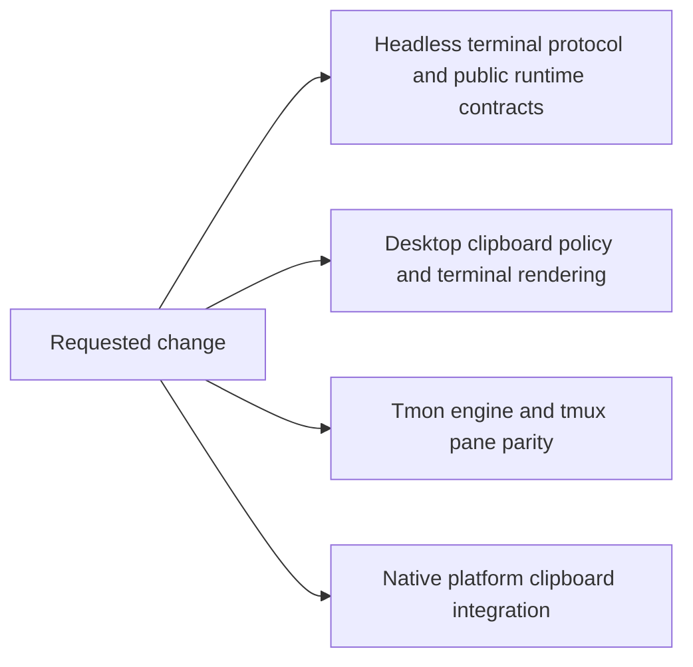

# Code Change Guardian

## Harden the current Kitty clipboard and graphics changes

> **NOT SAFE YET** · REFACTOR mode · baseline recorded; focused verification pending

The working tree adds two terminal protocols across both engines, the desktop app, tmux, native clipboard code, and public core contracts. Formatting and repository boundaries pass, but the high-risk protocol, permission, engine-parity, and platform paths still need focused tests and broad compilation evidence.

## Decision snapshot

| Field | Value |
|---|---|
| Requested change | Fix the risks in the current Kitty clipboard and graphics working-tree changes, including validation gaps and newly introduced maintainability problems. |
| Repository | `/Users/lassevestergaard/Dev/termy` |
| Branch / HEAD | `main` / `ff148615` |
| Working tree | Dirty — preserve existing changes |
| Generated | 2026-08-26T06:30:51.484Z |

### In scope

- Kitty OSC 5522 parsing, permission policy, MIME clipboard reads and writes, and paste events
- Kitty graphics Unicode placeholders, relative placement chains, clearing, cache invalidation, and engine parity
- Native, tmux, core, Tmon, desktop, documentation, smoke-test, and dependency-policy changes already present in the working tree
- Newly introduced code-size or coupling problems in changed files

### Out of scope

- Refactoring pre-existing allowlisted large files unrelated to the current diff
- Unrelated product redesign or feature work
- Publishing, committing, or discarding user changes

## Blast-radius map

| Surface | Relationship | Risk | Evidence | Files |
|---|---|---:|---|---|
| Headless terminal protocol and public runtime contracts | direct | High | The diff adds Kitty clipboard interceptors, reply-host methods, runtime events, graphics placement data, and public re-exports. | [crates/core/src/protocol/kitty_clipboard.rs](crates/core/src/protocol/kitty_clipboard.rs), [crates/core/src/protocol/kitty_clipboard_control.rs](crates/core/src/protocol/kitty_clipboard_control.rs), [crates/core/src/runtime.rs](crates/core/src/runtime.rs), [crates/core/src/lib.rs](crates/core/src/lib.rs) |
| Desktop clipboard policy and terminal rendering | direct | High | TerminalView now authorizes MIME clipboard access, handles paste events, renders relative placements, and invalidates graphics caches. | [crates/desktop_app/src/terminal_view/backend.rs](crates/desktop_app/src/terminal_view/backend.rs), [crates/desktop_app/src/terminal_view/mod.rs](crates/desktop_app/src/terminal_view/mod.rs), [crates/desktop_app/src/terminal_view/render.rs](crates/desktop_app/src/terminal_view/render.rs) |
| Tmon engine and tmux pane parity | direct | High | The diff changes Tmon parsing and placement resolution and routes Kitty clipboard controls through PaneTerminal and tmux events. | [crates/tmon/src/lib.rs](crates/tmon/src/lib.rs), [crates/tmon/src/graphics.rs](crates/tmon/src/graphics.rs), [crates/terminal_ui/src/pane_terminal.rs](crates/terminal_ui/src/pane_terminal.rs) |
| Native platform clipboard integration | direct | High | termy_native_sdk gains clipboard-rs dependencies and a cross-platform MIME clipboard module. | [crates/native_sdk/Cargo.toml](crates/native_sdk/Cargo.toml), [crates/native_sdk/src/clipboard.rs](crates/native_sdk/src/clipboard.rs), [Cargo.lock](Cargo.lock) |
| Embedding and public documentation | contractual | Medium | The core reply-host contract is public and website documentation now promises arbitrary MIME clipboard behavior and engine parity. | [crates/core/src/protocol/replies.rs](crates/core/src/protocol/replies.rs), [website/content/docs/customize/terminal-behavior.mdx](website/content/docs/customize/terminal-behavior.mdx), [website/content/docs/developer/libtermy.mdx](website/content/docs/developer/libtermy.mdx) |

## Failure modes

| ID | What could break | Score | Tier | Primary mitigation |
|---|---|---:|---:|---|
| R1 | Malformed or oversized terminal output bypasses bounds, corrupts protocol state, or produces incorrect replies. | 14/20 | High | Run parser and runtime tests, add missing boundary cases, and exercise the shell protocol smoke script. |
| R2 | Clipboard reads or writes skip confirmation, remember permission too broadly, or differ between native and tmux terminals. | 15/20 | High | Trace the full request path and run focused policy tests for denied, allow-once, remembered, listing, primary-selection, and paste-token cases. |
| R3 | Relative or Unicode-placeholder graphics render, clear, or cache differently across Alacritty, Tmon, native desktop, and tmux paths. | 14/20 | High | Run both engine test suites and the relative-graphics smoke script, then add parity cases for any uncovered state transition. |
| R4 | The native clipboard dependency or platform-specific implementation fails to compile or behaves incorrectly on macOS, Linux, or Windows. | 14/20 | High | Run native SDK tests, desktop checks, repository platform checks where available, and confirm dependency policy. |
| R5 | Large additions to existing hotspot files make protocol and runtime behavior hard to review and maintain. | 11/20 | Medium | Move cohesive new behavior into owned submodules when that reduces coupling without changing public behavior. |

### R1: Malformed or oversized terminal output bypasses bounds, corrupts protocol state, or produces incorrect replies.

- **Evidence:** OSC 5522 consumes untrusted terminal output and implements chunking, base64 metadata, request state, grants, and 64 MiB write limits.
- **Rollback:** Remove the new protocol modules and their runtime wiring with an inverse patch while leaving unrelated terminal behavior intact.

### R2: Clipboard reads or writes skip confirmation, remember permission too broadly, or differ between native and tmux terminals.

- **Evidence:** The desktop reply host, native SDK, core grant state, PaneTerminal, and tmux event forwarding all participate in one permission decision.
- **Rollback:** Disable Kitty clipboard interception and return unsupported replies until the policy path is restored.

### R3: Relative or Unicode-placeholder graphics render, clear, or cache differently across Alacritty, Tmon, native desktop, and tmux paths.

- **Evidence:** Placement semantics are implemented in core, Tmon, desktop render/cache code, and tmux pane snapshots.
- **Rollback:** Remove relative-placement and placeholder resolution while retaining the prior absolute graphics implementation.

### R4: The native clipboard dependency or platform-specific implementation fails to compile or behaves incorrectly on macOS, Linux, or Windows.

- **Evidence:** clipboard-rs is target-gated, adds reviewed license exceptions, and selects different native backends per operating system.
- **Rollback:** Remove clipboard-rs and keep clipboard operations behind the existing text-only host path.

### R5: Large additions to existing hotspot files make protocol and runtime behavior hard to review and maintain.

- **Evidence:** The diff adds about 680 lines to core kitty_graphics.rs, 237 lines to desktop backend.rs, 208 lines to PaneTerminal, and 155 lines to core runtime.rs. File-size checks already warn about several of these files.
- **Rollback:** Reverse each module extraction independently because the work must preserve signatures and tests.

## Contracts to preserve

| Contract | Required behavior | Evidence | Protection |
|---|---|---|---|
| Kitty clipboard protocol safety | Bounded parsing, correct chunk replies, request isolation, permission gating, and no clipboard-content disclosure during format listing. | Protocol constants and public request/result types in crates/core/src/protocol/kitty_clipboard.rs. | Focused core tests and scripts/test_kitty_clipboard.sh. |
| Terminal engine parity | Alacritty and Tmon expose matching clipboard events and graphics placement snapshots to consumers. | Backend adapters in crates/core/src/runtime and Tmon runtime event conversions. | termy_core tests under both backend environment settings plus tmon tests. |
| Desktop and tmux policy parity | Native and tmux terminals use the same clipboard authorization and paste-event policy. | Desktop backend reply host and terminal_ui PaneTerminal event forwarding. | Desktop tests, terminal_ui tests, and tmux integration where available. |
| Graphics placement semantics | Relative chains, Unicode placeholder placement, deletion, clearing, source rectangles, cursor movement, and cache generations agree across render paths. | Core and Tmon graphics placement code plus desktop rendering and cache changes. | Core, Tmon, terminal_ui, and desktop tests plus scripts/test_kitty_graphics_relative.sh. |
| Public and dependency contracts | termy_core remains GPUI-free, native SDK owns platform clipboard code, generated docs stay current, and new dependencies pass policy. | Crate READMEs, Cargo manifests, public re-exports, and xtask dependency policy. | just check-boundaries and cargo check --workspace. |

## Safe change plan

| Step | Change | Files | Validation | Rollback boundary |
|---:|---|---|---|---|
| 1 | Run focused protocol, engine, native SDK, terminal UI, desktop, and smoke-script tests; inspect every failure before editing. | [crates/core](crates/core), [crates/tmon](crates/tmon), [crates/native_sdk](crates/native_sdk), [crates/terminal_ui](crates/terminal_ui), [crates/desktop_app](crates/desktop_app), [scripts/test_kitty_clipboard.sh](scripts/test_kitty_clipboard.sh), [scripts/test_kitty_graphics_relative.sh](scripts/test_kitty_graphics_relative.sh) | Focused cargo tests under both core backends and both shell scripts. | No code rollback is needed for read-only checks. |
| 2 | Fix concrete protocol, permission, graphics parity, or platform failures and add regression tests. | [crates/core/src/protocol](crates/core/src/protocol), [crates/core/src/runtime](crates/core/src/runtime), [crates/tmon/src](crates/tmon/src), [crates/native_sdk/src](crates/native_sdk/src), [crates/terminal_ui/src](crates/terminal_ui/src), [crates/desktop_app/src/terminal_view](crates/desktop_app/src/terminal_view) | Repeat the nearest failing test after each coherent fix. | Apply an inverse patch for the individual fix if its focused test regresses another contract. |
| 3 | Extract cohesive new code from newly enlarged hotspot files when tests prove behavior preservation. | [crates/core/src/kitty_graphics.rs](crates/core/src/kitty_graphics.rs), [crates/core/src/runtime.rs](crates/core/src/runtime.rs), [crates/desktop_app/src/terminal_view/backend.rs](crates/desktop_app/src/terminal_view/backend.rs), [crates/terminal_ui/src/pane_terminal.rs](crates/terminal_ui/src/pane_terminal.rs) | Formatting, focused tests, and file-size policy. | Undo each extraction independently without changing feature behavior. |
| 4 | Run workspace, architecture, website, and available integration gates, then record residual platform or manual blind spots. | [Cargo.toml](Cargo.toml), [justfile](justfile), [website/package.json](website/package.json), [scripts/check-boundaries.sh](scripts/check-boundaries.sh) | just test-workspace, cargo clippy, just check-boundaries, website lint/typecheck/build, and applicable smoke tests. | Fix the owning change or mark the verdict NOT SAFE YET; do not weaken a gate. |

## Proof ledger

| Phase | Command | Result | Evidence |
|---|---|---|---|
| baseline | `git diff --check` | passed | Exit code 0 with no output. |
| baseline | `cargo fmt --all -- --check` | passed | Exit code 0 with no output. |
| baseline | `cargo metadata --no-deps --locked --format-version 1` | passed | Cargo resolved all 20 workspace members with the locked manifest. |
| baseline | `just check-boundaries` | passed | Generated docs, dependency policy for 856 packages, dependency boundaries, ignored-test budget, and file-size policy passed with 16 allowlisted warnings. |

## Unknowns and blind spots

- No full Rust workspace test, Clippy pass, website build, or live desktop smoke test has run against this working tree yet.
- Linux and Windows clipboard behavior cannot be observed directly on the current macOS host.
- Tmux integration depends on a compatible local tmux installation.
- External libtermy consumers outside this repository are not visible.

## Rollback strategy

- Keep protocol, native clipboard, graphics placement, and documentation fixes separable so each can be reversed with an inverse patch.
- Do not discard or restore the user-owned working tree wholesale.
- If a public contract cannot be proven safe, disable only the new protocol path and retain the prior terminal behavior.

## Next safest action

**Run focused tests for the changed protocol and engine paths, then fix the first concrete failure.**

---

_Generated by Code Change Guardian. “Safe” means supported by the recorded evidence, not risk-free._
