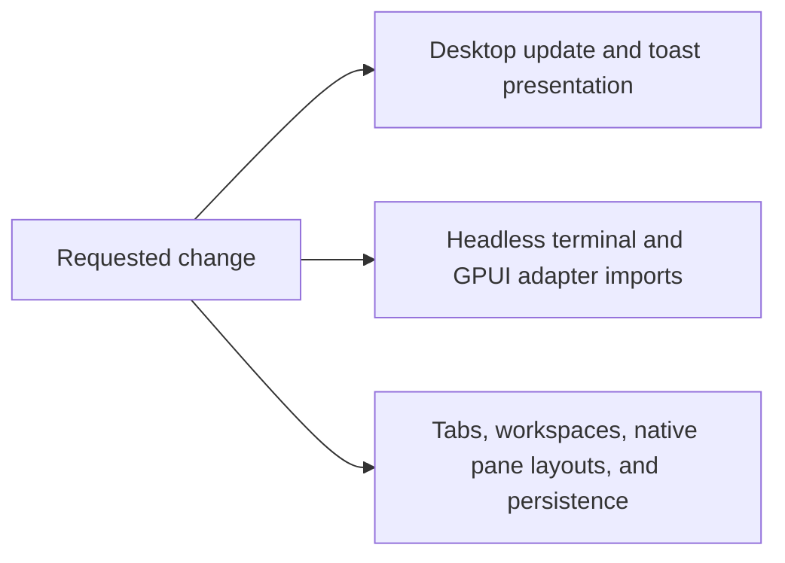

# Code Change Guardian

## Simplify Termy project structure without changing behavior

> **SAFE TO PROCEED** · REFACTOR mode · implemented and verified

The structural cleanup is complete in reversible slices. Desktop-only UI state now lives in the desktop app, terminal_ui exposes only adapters it owns, coherent session state and backend types have explicit private homes, and crate names and ownership docs are aligned. Focused and broad validation found no behavior regressions.

## Decision snapshot

| Field | Value |
|---|---|
| Requested change | Collapse shallow UI crates, remove terminal_ui forwarding modules, centralize tab and pane state, extract terminal backend adapters, and normalize crate naming without changing behavior. |
| Repository | `/Users/lassevestergaard/Dev/termy` |
| Branch / HEAD | `main` / `b2683d18` |
| Working tree | Dirty — preserve existing changes |
| Generated | 2026-08-15T17:55:17.000Z |

### In scope

- Move update banner and toast models into the desktop app
- Make termy_core ownership explicit and remove terminal_ui forwarding-only modules
- Centralize tab, workspace, pane layout, and active-pane invariants
- Move Alacritty, Tmon, and tmux backend adaptation behind one internal interface
- Update Cargo manifests, ownership documentation, and boundary policy

### Out of scope

- User-visible redesign
- Configuration or persistence format changes
- Public FFI changes
- Moving the repository into apps and packages directories
- Removing termy_native_sdk or termy_ffi

## Blast-radius map

| Surface | Relationship | Risk | Evidence | Files |
|---|---|---:|---|---|
| Desktop update and toast presentation | direct | Medium | termy_auto_update_ui and termy_toast are consumed by crates/desktop_app. | [crates/auto_update_ui](crates/auto_update_ui), [crates/toast_sdk](crates/toast_sdk), [crates/desktop_app](crates/desktop_app) |
| Headless terminal and GPUI adapter imports | direct | Medium | crates/terminal_ui contains forwarding modules that re-export termy_core symbols used by desktop_app. | [crates/core](crates/core), [crates/terminal_ui](crates/terminal_ui), [crates/desktop_app](crates/desktop_app) |
| Tabs, workspaces, native pane layouts, and persistence | direct | High | TerminalView owns 175 fields and tab/pane mutations span lifecycle, persistence, workspaces, sizing, and pane-move modules. | [crates/desktop_app/src/terminal_view](crates/desktop_app/src/terminal_view) |
| Alacritty, Tmon, and tmux runtime behavior | transitive | High | The desktop Terminal enum normalizes three backends and differential tests compare Tmon with the native engine. | [crates/desktop_app/src/terminal_view/mod.rs](crates/desktop_app/src/terminal_view/mod.rs), [crates/desktop_app/src/terminal_view/backend.rs](crates/desktop_app/src/terminal_view/backend.rs), [crates/desktop_app/src/terminal_view/tmon_adapter.rs](crates/desktop_app/src/terminal_view/tmon_adapter.rs), [crates/terminal_ui](crates/terminal_ui), [crates/tmon](crates/tmon) |

## Failure modes

| ID | What could break | Score | Tier | Primary mitigation |
|---|---|---:|---:|---|
| R1 | A tab mutation leaves the active pane or layout tree inconsistent. | 14/20 | High | Preserve and expand invariant tests, then route mutations through one SessionState interface. |
| R2 | Changing forwarding imports breaks desktop, FFI, tmux, or test-only consumers. | 11/20 | Medium | Trace all imports, migrate consumers mechanically, and run core, terminal_ui, FFI, and desktop checks. |
| R3 | Toast timing, queueing, or update-banner actions change during crate consolidation. | 8/20 | Medium | Move code and tests unchanged before adjusting names or interfaces. |
| R4 | Backend extraction changes native PTY, tmux display, Tmon parity, or platform-specific behavior. | 15/20 | High | Move the existing enum facade without changing methods, preserve parity tests, and run targeted plus workspace validation; report unavailable platform checks. |

### R1: A tab mutation leaves the active pane or layout tree inconsistent.

- **Evidence:** Active tab, active pane, panes, and layout maps are mutated across many terminal_view modules and guarded by runtime assertions.
- **Rollback:** Revert only the SessionState slice while retaining earlier crate cleanup.

### R2: Changing forwarding imports breaks desktop, FFI, tmux, or test-only consumers.

- **Evidence:** termy_terminal_ui publicly re-exports many termy_core types while consumers use both package-level and test-only paths.
- **Rollback:** Restore the forwarding modules and dependency entries.

### R3: Toast timing, queueing, or update-banner actions change during crate consolidation.

- **Evidence:** Both crates have focused tests and only the desktop app consumes them.
- **Rollback:** Restore the two crates and desktop dependency paths.

### R4: Backend extraction changes native PTY, tmux display, Tmon parity, or platform-specific behavior.

- **Evidence:** Backend behavior includes macOS, Linux, Windows ConPTY, tmux, rendering damage, and an experimental differential-test path.
- **Rollback:** Revert the backend module move independently.

## Contracts to preserve

| Contract | Required behavior | Evidence | Protection |
|---|---|---|---|
| Toast and update UI behavior | Existing queue, timing, action, state-to-model, and rendering semantics | Focused unit tests in auto_update_ui, toast_sdk, and terminal_view update modules | Run baseline tests, move tests unchanged, and rerun desktop tests |
| Terminal core and UI ownership | Headless behavior stays GPUI-free while desktop rendering and tmux workflows compile unchanged | Cargo manifests, crate READMEs, and boundary checks | cargo test for core and terminal_ui plus just check-boundaries |
| Tab and pane invariants | Every non-empty tab has a valid active pane and layout leaves match owned panes | TerminalTab invariant methods and regression tests | Characterization tests and targeted termy tests |
| Backend parity | Alacritty remains default, Tmon opt-in behavior is unchanged, and tmux display behavior is unchanged | Terminal enum behavior, environment gate, Tmon differential tests, and tmux tests | Targeted backend, parity, and terminal_ui tests |

## Safe change plan

| Step | Change | Files | Validation | Rollback boundary |
|---:|---|---|---|---|
| 1 | Capture focused baseline behavior and current boundary status. | [CODE-CHANGE-REPORT.md](CODE-CHANGE-REPORT.md) | Run update UI, toast, terminal_ui, and desktop checks. | No product code changed. |
| 2 | Move update banner and toast modules into desktop_app and remove their workspace crates. | [Cargo.toml](Cargo.toml), [crates/desktop_app](crates/desktop_app), [crates/auto_update_ui](crates/auto_update_ui), [crates/toast_sdk](crates/toast_sdk), [crates/README.md](crates/README.md) | Run focused moved tests, cargo check -p termy, formatting, and boundary checks. | Restore the two crate directories and manifests. |
| 3 | Make termy_core a direct desktop dependency and remove terminal_ui forwarding-only modules. | [crates/desktop_app](crates/desktop_app), [crates/terminal_ui](crates/terminal_ui), [crates/core](crates/core), [docs/architecture/project-layout.md](docs/architecture/project-layout.md) | Run core, terminal_ui, FFI, and desktop tests plus boundary checks. | Restore forwarding modules and imports. |
| 4 | Introduce SessionState and route tab, workspace, pane layout, and persistence mutations through it. | [crates/desktop_app/src/terminal_view](crates/desktop_app/src/terminal_view) | Run invariant, lifecycle, persistence, pane movement, termy, and formatting checks. | Revert SessionState changes only. |
| 5 | Move backend adapters behind one private terminal_view backend interface. | [crates/desktop_app/src/terminal_view](crates/desktop_app/src/terminal_view), [crates/terminal_ui](crates/terminal_ui), [crates/tmon](crates/tmon) | Run backend parity, core, terminal_ui, termy, workspace checks, and available platform checks. | Revert backend extraction only. |
| 6 | Normalize crate naming and ownership documentation after behavior-preserving work is green. | [Cargo.toml](Cargo.toml), [crates/README.md](crates/README.md), [docs/architecture/project-layout.md](docs/architecture/project-layout.md), [crates/tmon](crates/tmon), [crates/tmux_control_core](crates/tmux_control_core) | Run cargo metadata, formatting, workspace check, and boundary checks. | Revert naming-only moves. |

## Proof ledger

| Phase | Command | Result | Evidence |
|---|---|---|---|
| Baseline | `cargo test -p termy_auto_update_ui -p termy_toast -p termy_terminal_ui && cargo check -p termy` | passed | 3 update UI, 1 toast, and 150 terminal UI tests passed; 8 tmux integration tests were ignored by design; desktop check passed. |
| UI crate consolidation | `cargo test -p termy 'ui::' && cargo check -p termy` | passed | 13 moved desktop UI tests passed and the desktop crate compiled. |
| Session and backend | `cargo test -p termy terminal_view::` | passed | 628 terminal-view lifecycle, persistence, pane, render, Tmon parity, and update tests passed. |
| Renamed runtime and FFI crates | `cargo test -p tmon -p termy_tmux_control_core -p termy_terminal_ui -p termy_ffi` | passed | 279 Tmon, 47 tmux-control, 150 terminal UI, and 37 FFI/contract tests passed; 9 tmux integration tests remain opt-in. |
| Desktop regression | `cargo test -p termy` | passed | 813 unit tests and the Kitty graphics integration test passed. |
| Workspace compile | `cargo check --workspace` | passed | All workspace crates compiled after allowing GPUI's Metal module cache outside the sandbox. |
| Strict lint | `cargo clippy -p termy -p tmon -p termy_tmux_control_core -p termy_terminal_ui -p termy_ffi --all-targets -- -D warnings` | passed | Every changed Rust crate passed strict Clippy. |
| Architecture and format | `just check-boundaries && cargo fmt --all -- --check && git diff --check` | passed | Dependency policy, generated docs, file-size policy, ownership boundaries, formatting, and patch whitespace checks passed. |
| macOS runtime smoke | Native, experimental Tmon, and tmux-backed debug launches | passed | Native and Tmon accepted shell input and resized from 149x39 to 176x45; Tmon identified the experimental engine in logs. Tmux split into two 75x40 panes, moved focus between them, rendered both shells after resize, and removed its non-persistent server on quit. |

## Unknowns and blind spots

- Native behavior on Windows and Linux is not directly exercisable from this macOS checkout.
- External consumers of public workspace crates are not discoverable from repository search alone.

## Rollback strategy

- Keep each slice mechanically isolated so it can be reverted without undoing later unrelated work.
- Do not change persistence formats, public FFI contracts, configuration keys, or user-visible behavior.
- Stop before the next slice if focused validation contradicts the impact map.

## Next safest action

**Review and commit the verified patch as one behavior-preserving structural refactor.**

---

_Generated by Code Change Guardian. “Safe” means supported by the recorded evidence, not risk-free._
