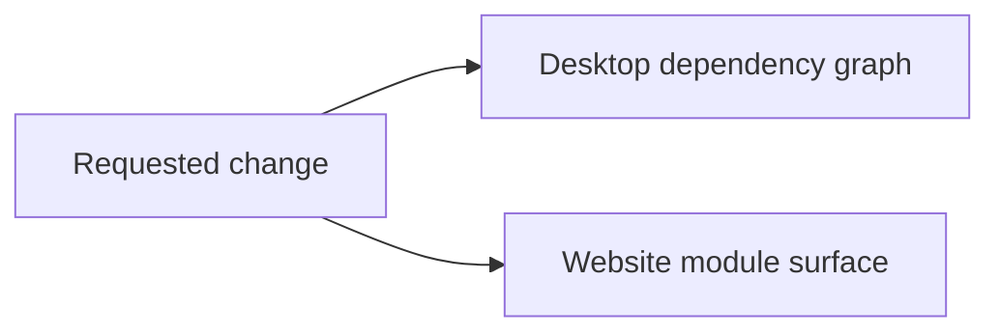

# Code Change Guardian

## Continue simplifying Termy without changing behavior

> **PROCEED WITH CONDITIONS** · REFACTOR mode · CRT-024 proof complete; apply approval required

CRT-024 passed baseline-plus-removal proof in disposable copies. The exact cleanup removes three manifest entries, 121 lockfile lines, and ten unreachable crypto packages while retaining rand_core for the plugin runtime. No product source has been changed.

## Decision snapshot

| Field | Value |
|---|---|
| Requested change | Continue simplifying and organizing Termy, remove proven bloat and duplication, and preserve behavior. |
| Repository | `/Users/lassevestergaard/Dev/termy` |
| Branch / HEAD | `main` / `ad429f7e` |
| Working tree | Clean |
| Generated | 2026-08-15T22:51:35Z |

### In scope

- Credible dead files, unused dependencies, forwarding-only modules, and duplicated internal implementations
- Small behavior-preserving ownership and organization improvements supported by repository evidence

### Out of scope

- User-visible redesign or feature removal
- Public FFI, configuration, persistence, plugin protocol, or database contract changes
- Speculative large-scale directory or architecture rewrites

## Blast-radius map

| Surface | Relationship | Risk | Evidence | Files |
|---|---|---:|---|---|
| Desktop dependency graph | direct | Low | cargo-machete flags p256 and rand_core as unused direct dependencies of termy; source search finds no desktop use and history ties them to the removed browser surface. | [Cargo.toml](Cargo.toml), [crates/desktop_app/Cargo.toml](crates/desktop_app/Cargo.toml), [Cargo.lock](Cargo.lock) |
| Website module surface | direct | Low | marketingPanelClass and appName have no consumers; GitHubReleaseYearGroup and Sponsor are used only within their defining files. | [website/src/components/marketing-page-shell.tsx](website/src/components/marketing-page-shell.tsx), [website/src/lib/github-release.ts](website/src/lib/github-release.ts), [website/src/lib/shared.ts](website/src/lib/shared.ts), [website/src/lib/sponsors.ts](website/src/lib/sponsors.ts) |
| Desktop terminal organization | transitive | High | terminal_view/mod.rs remains 6,090 lines, but its native layout types and methods are consumed across persistence, tabs, pane movement, mouse, render, tmux, and session state. | [crates/desktop_app/src/terminal_view/mod.rs](crates/desktop_app/src/terminal_view/mod.rs), [crates/desktop_app/src/terminal_view/session.rs](crates/desktop_app/src/terminal_view/session.rs) |

## Failure modes

| ID | What could break | Score | Tier | Primary mitigation |
|---|---|---:|---:|---|
| R1 | Removing the desktop dependency entries produces an incomplete or inconsistent lockfile or hides an indirect build requirement. | 7/20 | Low | Regenerate and compile in a disposable copy, then run desktop tests, formatting, and boundaries. |
| R2 | Removing or privatizing website exports breaks an alias-resolved, generated, or framework consumer missed by simple search. | 7/20 | Low | Prove the exact edits with website lint, typecheck, and production build in a disposable copy. |
| R3 | A broad native-layout extraction creates privacy churn or changes terminal session and pane behavior merely to reduce file size. | 14/20 | High | Defer this extraction until the dependency and website cleanup is complete, then design a separate characterized slice. |

### R1: Removing the desktop dependency entries produces an incomplete or inconsistent lockfile or hides an indirect build requirement.

- **Evidence:** Both static analyzer and repository search agree the direct entries are unused, but the current lockfile still records them under termy.
- **Rollback:** Restore the three manifest entries and candidate lockfile diff.

### R2: Removing or privatizing website exports breaks an alias-resolved, generated, or framework consumer missed by simple search.

- **Evidence:** Four exports have no external repository reference, but the website uses aliases and file-route generation.
- **Rollback:** Restore the two constants and two export qualifiers.

### R3: A broad native-layout extraction creates privacy churn or changes terminal session and pane behavior merely to reduce file size.

- **Evidence:** Native layout state has consumers in seven sibling surfaces and persistence contracts; the existing SessionState is still a shared mutable state bag.
- **Rollback:** Do not include terminal_view reorganization in the first batch.

## Contracts to preserve

| Contract | Required behavior | Evidence | Protection |
|---|---|---|---|
| User-visible terminal behavior | Tabs, panes, rendering, input, persistence, native shell, Tmon, and tmux behavior | docs/architecture/project-layout.md and desktop terminal-view tests | Focused crate tests, workspace tests, Clippy, formatting, boundaries, and manual smoke checks when visual behavior is touched |
| Headless and native APIs | termy_core, C header, FFI exports, and tmux control contracts | crates/core, crates/ffi/include/termy.h, and FFI contract tests | Core, FFI, and native SDK checks for any adjacent candidate |
| Repository ownership policy | Behavior remains in the smallest documented owner without forbidden dependency edges | crates/README.md and scripts/check-boundaries.sh | just check-boundaries |

## Safe change plan

| Step | Change | Files | Validation | Rollback boundary |
|---:|---|---|---|---|
| 1 | Prove CRT-024 in fresh baseline and candidate copies without touching the real worktree. | [Cargo.toml](Cargo.toml), [crates/desktop_app/Cargo.toml](crates/desktop_app/Cargo.toml), [Cargo.lock](Cargo.lock) | cargo check -p termy; cargo test -p termy --release; cargo fmt --all -- --check; just check-boundaries; cargo-machete | Discard both disposable copies |
| 2 | If CRT-024 proves green, present its exact lockfile delta and request separate approval to apply it to the real worktree. | [Cargo.toml](Cargo.toml), [crates/desktop_app/Cargo.toml](crates/desktop_app/Cargo.toml), [Cargo.lock](Cargo.lock) | User approval of CRT-024 and the observed candidate diff | No real product change before approval |
| 3 | After the dependency slice, prove the four website candidates CRT-015 through CRT-018 as one isolated website cleanup batch. | [website/src/components/marketing-page-shell.tsx](website/src/components/marketing-page-shell.tsx), [website/src/lib/github-release.ts](website/src/lib/github-release.ts), [website/src/lib/shared.ts](website/src/lib/shared.ts), [website/src/lib/sponsors.ts](website/src/lib/sponsors.ts) | bun run lint; bun run types:check; bun run build | Restore the two constants and two export qualifiers |
| 4 | Treat terminal_view organization as a separate characterized design task instead of mixing high-fan-out movement into bloat removal. | [crates/desktop_app/src/terminal_view/mod.rs](crates/desktop_app/src/terminal_view/mod.rs), [crates/desktop_app/src/terminal_view/session.rs](crates/desktop_app/src/terminal_view/session.rs) | Separate impact report and focused native pane/session regression suite | No terminal_view edits in this cleanup batch |

## Proof ledger

| Phase | Command | Result | Evidence |
|---|---|---|---|
| baseline | `git status --short --branch` | passed: main is clean and one commit ahead of origin/main | HEAD ad429f7e; no dirty entries before report artifacts |
| static discovery | `cargo-machete` | passed: reported p256 and rand_core as unused direct dependencies of termy | No other workspace dependency was reported unused |
| manual review | `repository reference and history searches` | passed: 19 scanner false positives rejected; five candidates remain REVIEW | Embedded plugin sources, Fumadocs config, route imports, generated declarations, and untracked .remember state were explicitly retained |
| disposable baseline | `untouched disposable baseline: cargo check -p termy; cargo test -p termy --release; cargo fmt --all -- --check; just check-boundaries` | passed | Desktop compiled; 804 unit tests and one integration test passed; formatting, generated docs, dependency policy, file-size policy, and boundaries passed |
| removal proof | `CRT-024 disposable candidate: cargo check -p termy; cargo test -p termy --release; cargo fmt --all -- --check; just check-boundaries; cargo-machete` | passed | Same 805 tests passed; all structural checks passed; cargo-machete reported no unused dependencies |

## Unknowns and blind spots

- CRT-015 through CRT-018 have not yet received website proof.
- The broad JS/TS scanner does not analyze Rust source; cargo-machete covered direct dependency usage, not dead Rust exports.

## Rollback strategy

- Keep discovery artifacts separate from product source.
- Approve and apply only one small causal cleanup batch at a time.
- Restore only the approved batch if its focused or broader verification fails.

## Next safest action

**Approve applying only CRT-024 to Cargo.toml, crates/desktop_app/Cargo.toml, and Cargo.lock, followed by the same checks in the real worktree.**

---

_Generated by Code Change Guardian. “Safe” means supported by the recorded evidence, not risk-free._
